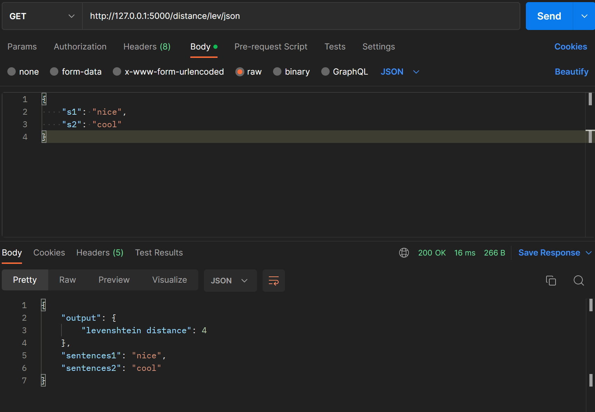
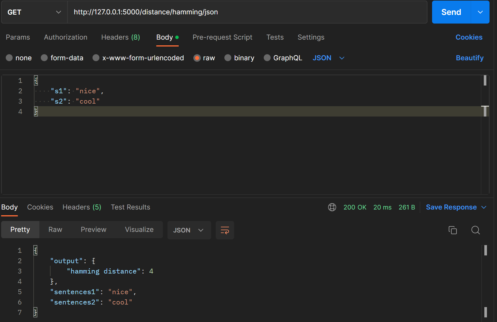
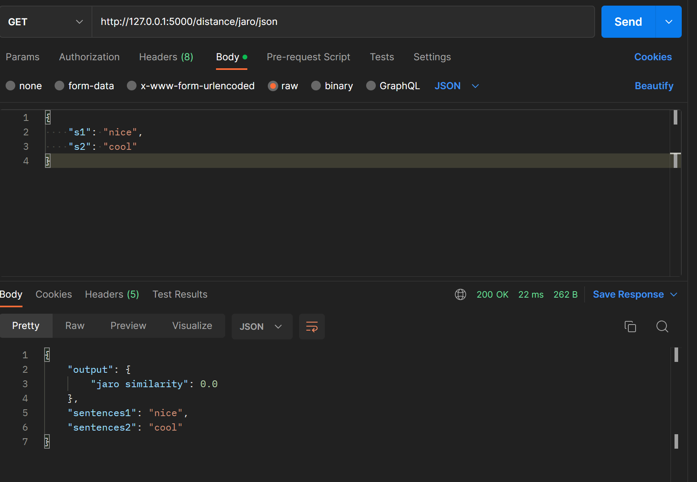

# Microservice Example

This project demonstrates how to build a light-weight microservice. The example microservice can calculate the Levenshtein distance, a normalized indel similarity, hamming distance and jaro similarity. This was possible by using the levenshtein library: https://github.com/maxbachmann/Levenshtein.git.

## What are Microservices?

Microservices are a software development approach that involves breaking down a large, monolithic application into smaller, independent services that communicate with each other through well-defined interfaces. This approach has gained popularity in recent years due to its ability to make applications more scalable, maintainable, and resilient.

One of the key advantages of using microservices is that it allows teams to work on different parts of the application independently, without having to worry about affecting the rest of the application. This can greatly increase the speed and efficiency of development, as well as reduce the risk of conflicts and errors.

Another benefit of microservices is that they make it easier to deploy and manage applications. Since each service is independent, it can be deployed and updated independently, without requiring a full application rollout. This can save a lot of time and effort, and make it easier to roll out new features and bug fixes.

Additionally, microservices can improve the resiliency of applications. Since each service is independent, a failure in one service does not necessarily affect the entire application. This can make applications more resilient to failures and outages, and improve their overall reliability.

Overall, the use of microservices can greatly improve the scalability, maintainability, and resiliency of applications. It is a powerful approach that can help teams to develop and manage applications more effectively.


## What is the Levenshtein Distance?

The Levenshtein distance is a measure of the difference between two strings of text. It is named after the Russian scientist Vladimir Levenshtein, who first described the algorithm for calculating the distance in 1965.

The Levenshtein distance is often used in applications such as spell checkers, speech recognition, and plagiarism detection. It is a useful measure of similarity between two strings, and can be used to determine how similar two strings are to each other.

To calculate the Levenshtein distance between two strings, the algorithm takes into account the number of insertions, deletions, and substitutions that would be needed to transform one string into the other. The distance is then the sum of these operations, with each operation having a cost associated with it.

The Levenshtein distance is a useful tool for comparing the similarity of two strings, and has a wide range of applications in text processing and analysis. It is a simple yet powerful algorithm that can help to improve the accuracy and efficiency of many different types of applications.


## How to use the microservice?

- install Docker
- install the app Postman
- build docker container via `docker build -t micro .`
- launch docker container via `docker run -p 5000:5000 micro`
- launch Postman, select `GET` and enter the URL provided to you upon the activation of the docker container
- select your preferred endpoint:
    - /distance/lev/json
    - /distance/ratio/json
    - /distance/hamming/json
    - /distance/jaro/json
- Within Postman: click on `Body`, select `raw` and choose `JSON`
- finally insert a json example and press send:

example json:

```
{
    "s1": "nice",
    "s2": "cool"
}
```

### Lev endpoint example



### Ratio endpoint example


### Hamming endpoint example



### Jaro endpoint example


